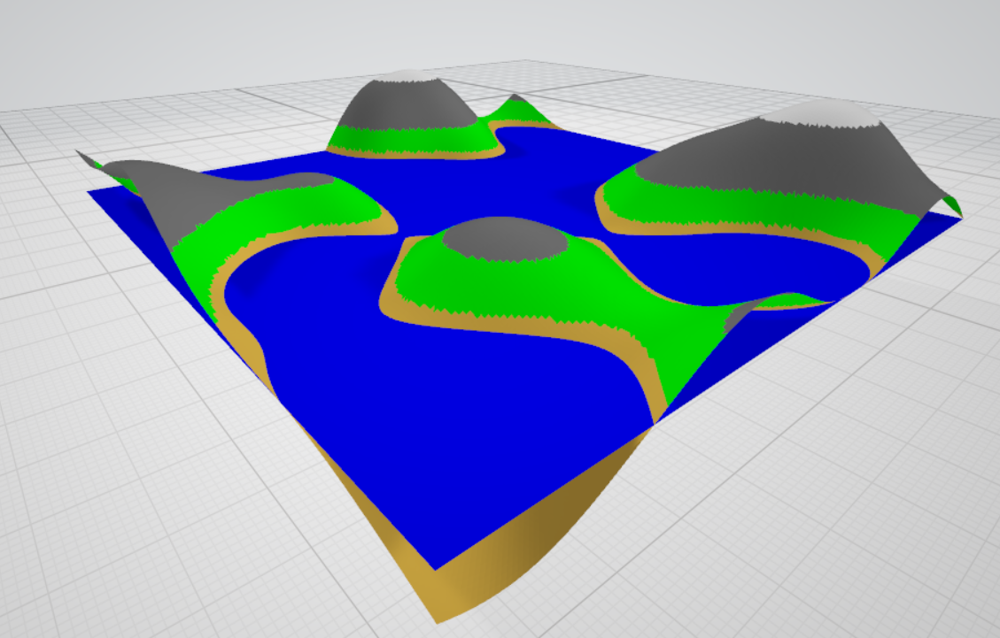
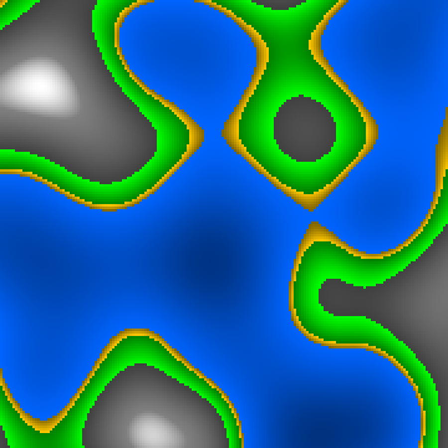

# Terrain generator
Generates a 3d terrain using Perlin Noise.

### Example of generated obj file


### Example of generated 2D map


# Build
```
gcc terrain.c perlin.c write_obj.c write_bmp.c -o terrain -lm
```

# Run
```
./terrain
```

---

Two files are generated: 
- `terrain.obj` - 3D model (uses `texturi.mtl` for materials)
- `map2d.bmp` - 2D map colored by altitude zone (water, sand, grass, rock, snow)
